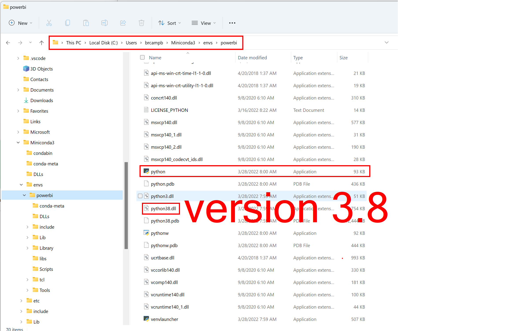

# Python In Power BI
Using Python in Power BI can be simplified by using virtual environments. In particular, I use conda for managing my environments. The benefit to using virtual environments are:
1. You can set the version of python you want to use
2. You can isolate your packages by projects thus eliminating bloat

To create your conda virtual environments you need to have installed on your computer either Anacada, or miniconda. There are other means of creating python virtual environments but I will present using Conda.

## Installing Conda
You can [Install Conda](https://docs.conda.io/projects/conda/en/latest/user-guide/install/windows.html) from this link. 


You will need to follow the instructions. Please note that if all you want is the package manager for conda then install **Miniconda** otherwise feel free to install **Anaconda**. The installation for either of these applications can be applied to the entire computer or to an individual. Please note, this will also make a difference in where your python virtual environments will be saved.

## Creating a Python Virtual Environment

To create a python virtual environment you will need to provide a name for the environment and a python version if you want a specific version. If you do not specify a python version then the default version on your computer will be used. **TIP** pass in the additional `-y` flag to create the environment with out having to answer questions. The following is an example of creating an environment
```
conda create -n powerbi python=3.8 -y
```
This line of code created a python version that is stored in either my miniconda env folder or anaconda env folder



You will notice that the python version is 3.8. You can make as many virtual environments as you want and specify the version of python to be executed

## Installing Python Packages

After creating your python environment, you will need to activate the environment and install packages into that environment. **NOTE** Pleae make sure to change your environment before installing packages. Do not install any additional packages into the **BASE** environment.
```
conda activate powerbi
```
This switches to my named conda environment

Now, with the selected environment activated, install packages into the environment using **PIP**
```
pip install <package name>

```

or using **CONDA** as some packages can only be installed using conda or pip
```
conda install <package name>
```

## Setting up Python in Power BI

The last thing you will need to do is tell Power BI where your python application is. By default Power BI determines the route to your python application by looking at the PATH as defined by your system environment variables. However, we are setting up a virtual environment and we want to tell Power BI to use a specific version of python with the packages that are installed in that environment.

You will first need to open the options in Power BI.
1. Click on File
2. Click on Options
3. Click on Python Scripting
4. Click on the drop down under **Detected Python home directories**
5. Select **Other**
6. Click on **browse** and find your created environment
7. Click **OK** to close options 


Now you can start using Python in Power BI. 

## Updating your Virtual Environment

If you need to make updates to your packages or install more packages then do the following
1. Open a Terminal
2. Activate the environment
3. Use **PIP** or **CONDA** to install your packages.

**NOTE** You may need to close and reopen Power BI after installing your python packages.


